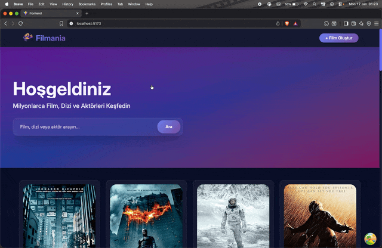

# 🎥 Full-Stack Movie Web App

This project is a **full-stack movie application** where users can browse movies and create new ones.  
It was built with React on the frontend and a backend API for data management.

## 🚀 Features

- 🎬 **Movie Listing**: Browse and view movie details.
- ➕ **Create New Movie**: Add movies with title, description, and other details.
- 🔄 **Dynamic Routing**: Smooth navigation between pages using `react-router-dom`.
- 🎨 **Modern UI**: Styled with `tailwindcss` for a clean and responsive design.
- ⚡ **API Integration**: Data fetching and posting handled with `axios`.
- ✨ **Icons**: Beautiful icons powered by `lucide-react`.

## 🛠️ Tech Stack

- **Frontend**: React, TailwindCSS, Lucide-React
- **Routing**: React Router DOM
- **HTTP Client**: Axios

## Screen Gif

